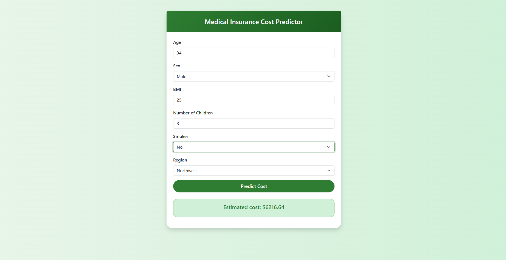

# 🏥 Medical Insurance Cost Predictor

A simple Flask web app that predicts the medical insurance cost for an individual based on their personal details using a **Linear Regression** model trained on the classic `insurance.csv` dataset.


---

## 📌 Features

- Predicts medical insurance charges in real-time
- Uses Linear Regression from Scikit-learn
- Trained on real-world dataset from Kaggle
- Web-based frontend using Flask and HTML
- Lightweight and easy to run locally

---

## 🚀 Demo

> Input personal details like age, BMI, region, and smoking status.  
> Get an instant prediction for expected insurance cost.

 <!-- Replace with your screenshot path -->

---

## 🧠 Technologies Used

| Area         | Tools / Libraries              |
|--------------|-------------------------------|
| Language     | Python 3.10                    |
| ML Model     | Scikit-learn (LinearRegression)|
| Web Framework| Flask                          |
| UI           | HTML + Jinja2                  |
| Data         | Pandas, NumPy, insurance.csv   |
| Deployment   | Localhost / Vercel / Railway   |

---

## 🧪 Dataset

- **Name:** Medical Cost Personal Dataset  
- **Source:** [Kaggle Dataset](https://www.kaggle.com/datasets/mirichoi0218/insurance)  
- **Fields:**
  - `age`: Age of the primary beneficiary
  - `sex`: Insurance contractor gender (`male`, `female`)
  - `bmi`: Body mass index
  - `children`: Number of children covered by health insurance
  - `smoker`: Smoking status (`yes`, `no`)
  - `region`: Residential area in the US
  - `charges`: Target value (medical cost)

---

## 📁 Project Structure

insurance-predictor/

├── app.py # Flask server

├── train.py # Model training script

├── insurance.csv # Training dataset

├── insurance_model.pkl # Saved ML model

├── templates/

│ └── index.html # Frontend HTML

└── README.md # Project documentation

---

## ⚙️ How to Run Locally

### 1. Clone the Repo
```bash
git https://github.com/IamThejus/Medical-Insurance-Cost-Prediction.git
cd Medical-Insurance-Cost-Prediction
```
2. Create Virtual Environment
```
python -m venv venv
source venv/bin/activate   # on Unix/macOS
venv\Scripts\activate      # on Windows
```
3. Install Requirements
```
pip install -r requirements.txt
```
4. Train the Model
```
python train.py
```
5. Run the App
```
python app.py
```

🌐 Live Deployment
Coming soon on Vercel or Railway!

✅ To Do

* Train & test a baseline model
* Build a working Flask app
* Add model performance metrics
* Improve frontend UI
* Deploy online

📄 License

This project is licensed under the MIT License.


🙋‍♂️ Author


Thejus Asokan
* LinkedIn
* GitHub


---
🙌 Acknowledgements
* Kaggle - Insurance Dataset
* Scikit-learn
* Flask
---


### ✅ Optional Additions:
- Add a `requirements.txt` file like:
```txt
Flask
joblib
pandas
scikit-learn
```
